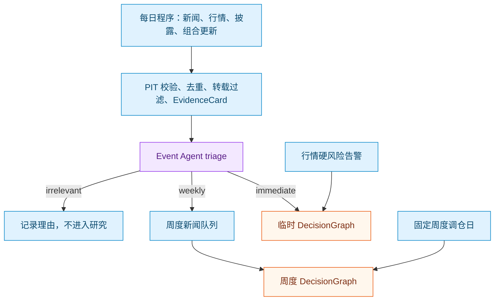
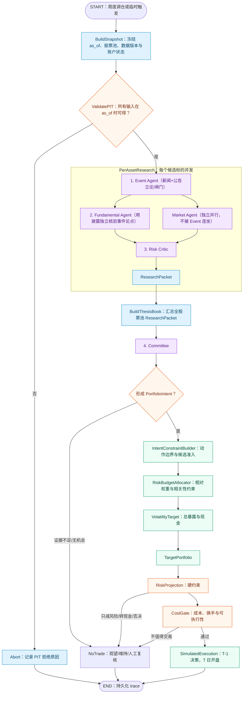
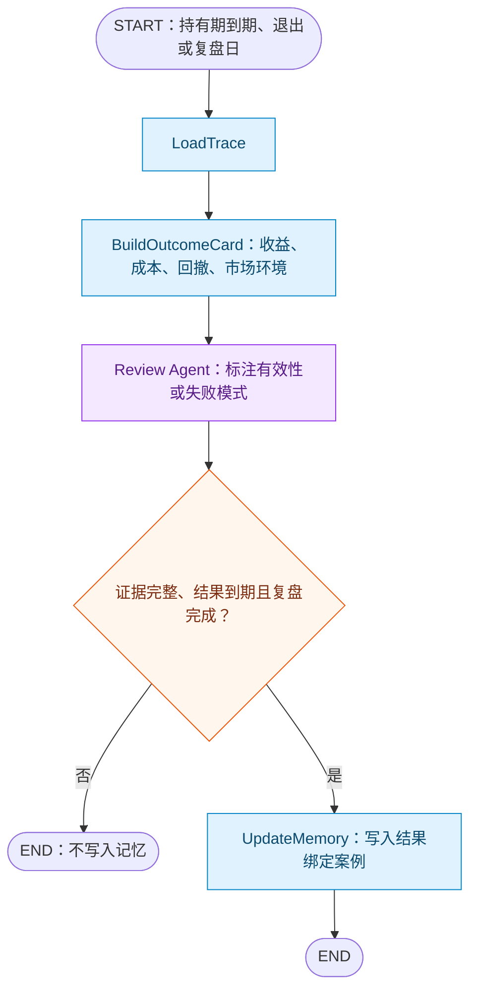

# Plan：可审计量化 Agent 开发计划

> 权威状态：当前唯一架构与开发计划
> 更新：2026-10-05
> 研究提案见 [`agent_application_proposal.md`](agent_application_proposal.md)；实验登记册见 [`experiment_index.csv`](experiment_index.csv)。

## 1. 目标、范围与当前基线

目标是构建一个面向美股的量化研究与**模拟执行**系统：从时点安全的新闻、披露和行情出发，形成可引用的投资论点，经过多 Agent 交叉核验、组合决策、硬风控和成本门控，最后对结果进行复盘。

项目不以“让 LLM 预测涨跌”或“提高单次收益”为唯一目标。核心成果是：每个建议可回放、每项事实有来源和可得时间、证据不足时能观望、组合决策不绕过成本与风控、实验可复现。

首版范围是美股、周频常规调仓、事件驱动的临时复核和 T-1 决策/T 日开盘模拟成交。未经明确授权，不接入实盘自动下单。

当前代码可复用的起点包括：PIT 新闻管道、行情缓存、单 LLM 新闻分析、VADER 对照、T-1/T 日模拟撮合、成本与规则风控、逆波动率权重、公式总暴露和 PPO 总暴露实验路径。固定 Top-K 与新闻分数路径作为实验对照；目标主线输出 ResearchPacket 与 PortfolioIntent。

## 2. 不可破坏的设计原则

1. **事实与模型分离。** 新闻、披露、行情和成交是可追溯事实；LLM 只能基于事实生成带引用的论点，不能改写事实。
2. **时点安全优先。** 每轮研究只使用 `as_of` 时点已公开的数据；任何晚于该时点的来源必须被拒绝并记录原因。
3. **Agent 无状态。** Event、Fundamental、Market、Risk Critic 和 Committee 每次均从本轮 Snapshot、上游 Card 与允许的查询重新构建输入；不依赖上次模型聊天记录。
4. **研究与交易分离。** LLM 最多输出 `PortfolioIntent`；权重、总暴露、硬风控、成本判断和订单由确定性组件处理。
5. **审计优先于便利。** 所有输入、引用、模型版本、输出、风险投影、成本判断和成交均以 `trace_id` 串联，可离线重放。
6. **先建立可解释基线。** 多 Agent、PPO 或任何复杂模块未在统一 PIT、成本和风险条件下证明稳定增量前，不进入主结论。

## 3. 目标业务状态机

系统由两个独立图组成：`DecisionGraph` 产生研究意图与模拟成交；`OutcomeGraph` 在结果到期后复盘。后者不反向修改已经结束的决策。

### 3.1 DecisionGraph：从每日感知到组合意图与模拟执行

#### 3.1.1 每日数据更新、新闻分流与触发

程序每天拉取新闻、行情、披露和账户状态；这些步骤不由 LLM 执行。行情采集每轮先用 `load_price_frame` 合并截至 `as_of` 向前 400 个自然日的已有 PIT 批次，仅补该窗口缺失的前段或尾段，并返回新旧合并帧；coverage 台账只审计请求，不能证明数据完整。组合风险要求全池至少 253 个对齐收盘价。

| 数据 | 每日程序处理 | 对决策图的作用 |
| --- | --- | --- |
| 新闻 | 原始缓存、PIT 校验、URL/hash 去重、转载过滤、建立 EvidenceCard | Event Agent triage 后分流为 `irrelevant`、`weekly` 或 `immediate` |
| 行情 | 更新 OHLCV、流动性、波动、趋势、横截面特征和市场 regime | 构建 Market Agent 输入；硬风险告警可触发临时决策图 |
| 披露 | 检查并解析新 10-K、10-Q、8-K、业绩公告和 XBRL | 构建 Fundamental Agent 输入；关键披露可触发临时决策图 |
| 组合 | 更新持仓、现金、净值、回撤、行业暴露、换手和订单状态 | 构建 Committee、RiskProjection 与 CostGate 输入 |

每日 Event triage 只读取新增且已去重新闻的标题、摘要、来源和必要公告片段：

- `irrelevant`：记录筛查理由，不进入研究队列；
- `weekly`：进入本周对应标的的新闻队列；
- `immediate`：启动受影响标的的临时 PerAssetResearch，必要时启动临时 Committee。

重复报道由 URL/hash 去重和转载过滤处理；周度 Event Agent 基于同一标的本周 `weekly` 新闻队列生成带引用的 ClaimCard，并在其中表达相关事实共同支持或反驳的投资论点。



行情风险告警不会直接下单。daily 在行情入库后用 `runtime.update_risk_state` 从 PIT 日线重放 ATR 止损、`peak_equity` 与回撤；它把新 `risk_state` 回交账户。若止损或首次锁仓，daily 必须已获注入模型，并在同一个 `run_research_round` 内复用本轮卡池自动启动既有临时 DecisionGraph；即使 Agent 建议 `hold`、`reduce` 或 `exit`，也必须继续经过 PortfolioPolicy、RiskProjection 和 CostGate 后才产出 `OrderPlan`。没有风险事件时 daily 不调用模型。`untradable` 是当轮 `TradingInputs` 的现算交易能力，不写入 `risk_state`；`risk_locked` 自动置位、只能由人工显式复位。

建卡与冻结由 `SnapshotBuilder` 的两个独立入口承接，对应上图的两种节奏：`ingest_records`（每日/事件驱动：PIT 校验、按「正文哈希 + 标的」去重、落正文、建 EvidenceCard，不冻结）与 `freeze_snapshot`（DecisionGraph 启动时按标的与可得时间窗口从卡片池选卡冻结，不建卡）。两者各占独立 trace；周度脚本可顺序串联两步（沿用本轮建卡结果显式传卡集），每日也可只跑建卡。实盘模式下采集脚本在全部采集完成后才定 `as_of`，本轮到达的数据本轮即可用；传 `--as-of` 回放时时点钉死，本轮新拉数据因 available_at 晚于时点被 PIT 闸门拒绝。

##### 编排入口收敛于 `agents/research/flow.py`

「采集 -> 建卡 -> 冻结 -> 逐标的研究图 -> Committee」的阶段门控与 trace_id 生成只有一个实现处：`run_research_round(options, *, model=None)`，三种节奏为 `daily`（只采集建卡入池，不冻结）、`collect`（采集并用本轮卡集点名冻结）、`decide`（按 `available_from` 池选卡冻结，再跑研究图与 Committee 产出 `PortfolioIntent`）。

`scripts/research_run.py` 不映射这三种节奏，只保留**一个跑全程的人类入口**：默认 `collect` + 注入模型，一条命令走完采集→建卡→冻结→研究图→委员会并逐节点打印。`daily` 与 `decide` 由外部定时调度器直接调用 `run_research_round`，不再各自养一份命令行参数装配。四条边界：

1. **不跑研究就不碰模型。** `daily` 不构造 `LLMClient`，定时采集因此不依赖 API key，也不会误烧付费调用。
2. **要决策就必须给真实账户。** `decide` 要求调用方传入 `account_state`（cash/positions/limits/regime/成本估计），缺账户直接失败而不退回占位值：Risk Critic 的 prompt 明确「缺 limits 或持仓状态不得当作放行」，占位账户只会跑出一轮全 `abstain` 的无效意图，白烧模型还留下一条看起来成功的 trace。
3. **观测不属于编排。** 逐节点打印是调用方对模型客户端的包装（`research_run.py` 的终端 `TracingModel`、`viz/` 的事件版包装各一份，只解读调用内容），`flow` 内不含 `print`、事件总线或前端耦合，同一函数可被 CLI、外部调度器和 `viz/` 复用。采集能力始终在 `flow` 这一侧，研究 Agent 侧拿不到任何采集入口（见 4.2）。

#### 3.1.2 一次 DecisionGraph 的执行顺序



`PerAssetResearch` 的单标的图为 `(Event → Fundamental) ‖ Market → Risk Critic → ResearchPacket`：Event 先读新闻与公告立论或弃权，随后 Fundamental（仅在存在事件论点时用独立披露核验）与 Market（以 Event 论点为只读语境解读价量确认/背离，补查与引用锁在行情类，不被 Event 弃权连坐）并行，Critic 扇入三张卡。缺证据、引用或输出 schema 非法、模型调用失败等情况，节点必须走显式的非 `proceed` 路由并带原因码，而不是静默产出半成品 Packet。当前研究阶段只打通到 `ResearchPacket`；Committee、仓位分配、订单、执行与回测属于其后阶段。

#### 3.1.3 Agent 节点：输入、输出与边界

研究节点采用「注入 hook + 单工具补查」：每个 Agent 在调用模型**之前**先执行一个数据注入 hook（由各 Agent 自行声明读哪些冻结批次），把该标的本周证据（Event 读 news、Fundamental 读 filing/XBRL、Market 只读本标的 market）**无条件组装进初始 prompt**——类别取数由代码直接调 Gateway 完成，不再作为模型工具暴露，因此模型默认单轮即可产出 ClaimCard，不再需要花一轮工具调用去「要」它本就该看到的证据。模型唯一可自主发起的只读工具是 `search_evidence`（补查），仅当它判断注入批次不足时才调用；若仍不足则走一次性 `data_request` 弃权而不是无限补查。`tools.py`（`ResearchTools`）是工具目录与受控执行循环的**唯一实现处**（预算/参数校验/正文截断/trace 记账），Agent 文件只负责声明挂载哪几个工具与注入 hook；模型不能取得 API key、Provider、文件路径或数据库连接，也不能触发任何网络请求。Risk Critic 是例外：它的四项上下文（当前仓位、换手/成本估计、regime、peer）本就是每轮必读的固定输入，因而全部走注入 hook 直接拼装、**不挂载任何工具**，以单轮 `chat_json` 输出 verdict。Gateway 全程只读账本与原始正文库；缺证据不在研究过程中补——补齐数据是采集脚本在冻结之前的职责。补查工具名、参数、来源、返回 EvidenceCard ID、失败码与结果数均写入研究 trace（默认注入的批次则由 Gateway 的 `gateway_queries` 审计）。

研究图的输入是采集脚本在 DecisionGraph 启动前冻结好的决策 Snapshot：`as_of`、股票池与卡集此后不再改变。Gateway 不联网，因此研究过程中不存在“补到新卡”，也不再需要 `ResearchRun` 生命周期；实盘与历史回放走完全相同的只读路径，同一份 Snapshot 重放得到同一批输入。证据不足时模型走显式的 `data_request` 路由并弃权，原因写入 trace；缺口由下一轮采集脚本补齐后重新冻结再研究，未补齐的数据不会进入本次决策。所有 Claim 只能引用本节点可见的 EvidenceCard ID——即初始 prompt 注入的冻结批次，加上 `search_evidence` 补查实际返回的卡片；补查被 `ResearchTools` 锁在本节点证据维度内（Event 只能搜 news、Fundamental 只能搜 filing、Market 只能搜 market），维度分工不给补查开后门；二者均严格落在本 Snapshot 冻结卡集内。行情继续复用 `core/indicators.py` 预处理为 market EvidenceCard（由采集脚本计算），财报/XBRL 由 SEC 采集器结构化，新闻保持 EvidenceCard 摘录；模型不做数值计算，也不存在静默 fallback 或人工重跑。

所有 Agent 的调用输入由 Snapshot Builder 在该节点即时组装，并保存输入 Card ID、Gateway 查询 ID、模型/提示词版本和输出 schema 校验结果。数据包超出 token 预算时，Builder 减少选择范围并保留可回查 ID；研究事实始终以 Snapshot、EvidenceCard、ClaimCard 和 Gateway 回查结果为准。每个研究节点的提示词必须显式声明证据范围、允许的推断边界、引用/反证/未知项处理规则、弃权条件与精确的输出 schema；细化提示词只为提高 schema 合规率，绝不因此赋予 Agent 读取非冻结数据或绕过确定性控制的能力。

##### 1. Event Agent

- **输入：** 该标的本周 `weekly` 新闻、必要公告片段、EvidenceCard ID 与 `as_of`；每篇新闻带来源、`published_at`、`available_at` 和原文摘录。
- **实现：** 按 schema 提取事件类型、受影响主体、可验证事实、传导路径、支持/冲突 EvidenceCard ID、时效和未知项；每一项事实必须引用 EvidenceCard。
- **输出：** Event ClaimCard，以及 `weekly` / `immediate` / `abstain` 的研究分流结论。
- **边界：** 只基于当轮 Snapshot 形成研究论点，不产生交易建议。

##### 2. Fundamental Agent

- **输入：** Event ClaimCard、其引用原文、PIT 合格的 10-K/10-Q/8-K、业绩公告和 XBRL 切片。
- **实现：** 程序先计算同比/环比、指引变化和口径差异；Agent 将这些变化与事件传导路径逐项核对。
- **输出：** Fundamental ClaimCard，记录收入、利润、现金流、指引和风险因素的支持/反证，以及无法验证的项目。
- **边界：** 独立核验披露，新闻摘要不能替代披露证据。

##### 3. Market Agent（独立并行分支，不依赖 Event）

- **输入：** 本标的程序计算的 1/5/20 日收益、实现波动率、成交量异常、流动性、回撤和趋势。
- **实现：** 独立解释本标的行情状态；不读取 Event、peer 或 regime。价格、指标和阈值均由程序计算。
- **输出：** 带数据字段 ID 的 Market ClaimCard。
- **边界：** 不编造价格或技术指标；与事件链并行独立运行，本轮无新闻/无事件论点时仍产出行情判断。

##### 4. Risk Critic

- **输入：** Event、Fundamental、Market ClaimCard，当前仓位、行业暴露、流动性、预估换手和成本。
- **实现：** 程序提供集中度、仓位变化和成本数值；Agent 交叉检查证据冲突、时效、已定价风险、既有持仓矛盾和成本覆盖问题。
- **输出：** `allow`、`caution`、`abstain` 或 `human_review`，并附原因和 Card ID。
- **边界：** 不改写上游事实，不执行硬风控或订单。

`ResearchPacket` 由程序汇集一个标的的 Card、引用覆盖率、时效、冲突、当前持仓和 Critic 结论。Fundamental 必须能回查 Event 引用的原始证据与独立披露；Risk Critic 是研究阶段的软否决，不能与后续确定性的 RiskProjection 混淆。

##### 5. Committee

| 输入块 | 内容 |
| --- | --- |
| 固定规则 | 投资范围、允许动作、持有期与成本敏感原则、输出 schema。 |
| 当前组合快照 | 全股票池 ResearchPacket 摘要、持仓/现金/入场价/持有期、市场 regime、可交易性和本周成本估计。 |
| 调仓差异 | 上次 PortfolioIntent、实际成交或未成交、期间成本与换手、本周新增、失效或被反证的 ClaimCard。 |
| 可选结果记忆 | 少量已具备 OutcomeCard 与 Review 标签的相似案例；首版可以为空。 |

- **实现：** 在全股票池比较 ResearchPacket，结合当前组合和调仓差异决定每只标的的研究动作、候选准入优先级和持有期。
- **输出：** PortfolioIntent；每只标的包含 `long/hold/reduce/exit/abstain`、动作强度、持有期、优先级、支持/反对 Card ID 和不交易理由。
- **边界：** 不读原始全文或 Agent 聊天，不输出百分比权重、预期收益数值、连续强弱分数或订单。Committee 先由冻结的 `ResearchPacket` 摘要构建 `ThesisBook`，再只产出带引用的 `PortfolioIntent`；被 Critic 判为 `abstain`/`human_review` 的标的，在 Intent 中必须保持 `abstain`。
- **违规治理（分级）：** `_validate_items` 的拦截按违规粒度分流，不再一律全池弃权：
  1. **标的局部违规**（单只 bypass Critic 否决、引用 ID 越出本标的 Packet、非 abstain 缺支持 Card）——仅该标的的 item 强制替换为 `abstain`，`no_trade_reason` 写明原始违规；其余合规 item 保留。
  2. **全局结构违规**（symbol 集合缺失/重复/越池、响应无法解析、越界字段）——说明整份响应的生成基础失效，维持全池弃权，不部分采信。
  3. **反静默篡改**：发生任何矫正时，模型原始响应以 `tool_calls` 记录入账（node=`committee`，tool_name=`raw_response`，arguments=原始 response、result_count=违规数、evidence_ids=违规标的），保证“模型实际想说什么”与“系统最终采纳了什么”均可重放；矫正后的 Intent 仍是合法 `PortfolioIntent`，下游无需兼容处理。

#### 3.1.4 组合、硬风控与执行

Committee 输出研究意图而非百分比权重。组合层采用“**动作约束 → 风险预算参考分配 → 波动率目标 → 成本敏感执行调整**”的确定性程序链路：

1. **IntentConstraintBuilder** 将 `long/hold/reduce/exit/abstain` 与动作强度转为候选准入、最低/最高权重和交易许可；`long` 受持仓名额、种子仓位与优先级的确定性准入约束。它不生成收益预测或连续选股分数。
2. **RiskBudgetAllocator** 仅在获准持有的股票之间，以逆波动率为参考分配，并结合协方差、行业、流动性、旧仓位与换手约束求相对权重；求解器、目标系数与输入窗口均为版本化配置，缺任一数值输入即显式失败。
3. **VolatilityTarget** 以组合预估波动率缩放相对权重，决定总股票暴露与现金。
4. **RiskProjection** 对目标组合施加单股、行业、总暴露、现金下限、流动性、换手、回撤和止损等硬限制；它只能收缩风险、增加现金或否决。
5. **CostGate** 检查订单最小规模、流动性参与率、最大换手、佣金、半价差滑点、市场冲击和可用现金；它必须以逐订单 notional 估算成本并记录延后数量/成本，延后或缩小不必要、不可执行的小额交易，不基于未验证的预期收益放行订单。

##### IntentConstraintBuilder：五个动作如何进入仓位计算

它是确定性程序，不是 Agent。每只标的的 `PortfolioIntent` 会被转成以下边界：

| Committee 动作 | 程序约束 |
| --- | --- |
| `long` | 按优先级进入可持有集合；准入后允许从零建仓，受种子仓位、单股上限和流动性限制。 |
| `hold` | 以当前权重为中心的窄调整区间，不因常规配置而大幅主动变化。 |
| `reduce` | 新权重不得高于当前权重；动作强度确定低于旧仓的目标上限。 |
| `exit` | 新权重固定为零，生成强制退出订单。 |
| `abstain` | 未持有时固定为零；已持有时禁止增加，仅允许硬风控被动降低。 |

`priority` 只在持仓名额、风险预算或流动性不足以容纳全部 `long` 候选时决定准入顺序；它不线性映射为个股预期收益或百分比权重。

##### RiskBudgetAllocator：相对个股权重如何产生

对获准持有集合 $A$，程序从截至 `as_of` 的行情计算波动率 $\hat{\sigma}_i$ 与协方差矩阵 $\hat{\Sigma}$。逆波动率参考权重为：

$$
b_i = \frac{1 / \hat{\sigma}_i}{\sum_{j \in A} 1 / \hat{\sigma}_j}
$$

最终相对权重 $w$ 在动作约束内求解：

$$
\min_w\quad
\alpha\lVert w-b\rVert_2^2
+ \beta w^\top\hat{\Sigma}w
+ \gamma\lVert w-w_{\mathrm{prev}}\rVert_1
$$

约束包括 `sum(w)=1`、长仓、单股和行业上限、流动性、最大换手，以及上节由五个动作生成的权重边界。第一项保持接近易解释的逆波动率参考分配，第二项避免高相关股票集中，第三项抑制无意义换手。它不含收益预测项；Committee 决定“是否值得占用风险预算”，程序只决定“在允许集合中如何分配风险”。

##### VolatilityTarget：总暴露、现金与实际订单

相对权重 $w$ 的组合预估波动率为：

$$
\hat{\sigma}_p = \sqrt{w^\top\hat{\Sigma}w}
$$

设账户目标波动率为 $\sigma_{\mathrm{target}}$、最大股票总暴露为 $E_{\max}$，目标总暴露为：

$$
E_{\mathrm{target}} = \min\left(E_{\max}, \frac{\sigma_{\mathrm{target}}}{\hat{\sigma}_p}\right)
$$

绝对账户权重为 $x_i=E_{\mathrm{target}}w_i$，现金权重为 $1-E_{\mathrm{target}}$。降低总暴露可以立即执行；增加总暴露受单周期上调上限限制。若动作边界、硬风控或 CostGate 阻止部分交易，剩余资金保留为现金，并记录偏离目标的原因。

`TargetPortfolio` 记录股票与现金权重、总暴露、动作边界、风险输入、成本估计和 `trace_id`。它经过 RiskProjection 与 CostGate 后才会变成 `OrderPlan`；实际成交由 SimulatedExecution 按 T-1/T 日时序记录。

##### RiskProjection：把目标组合投影到不可违反的风险边界

RiskProjection 是确定性程序，输入为 `TargetPortfolio`、最新可交易行情、当前账户、硬风控状态和风险限额；输出为 `RiskProjectedPortfolio` 与逐项 `reason_code`。它不重新选股、不提高任何目标仓位，也不覆盖 Committee 的 `exit` 或 `reduce` 动作。

按以下顺序处理：

1. **数据与账户可用性。** 行情、协方差、持仓、现金或价格超过有效期，或股票停牌/不可交易时，拒绝相关新增交易并记录 `stale_data`、`untradable` 等原因。
2. **强制风险退出。** `exit`、止损、单标的灾难性跌幅和账户级强制去风险先执行；无法立刻成交时生成受流动性限制的退出计划，而不是把该风险视为已消失。
3. **持仓、集中度与流动性上限。** 对单股、行业、总暴露、现金下限、单日参与率和最大换手执行硬上限。若 TargetPortfolio 超限，只按预定义比例收缩相关股票并把差额留为现金。
4. **组合风险与回撤限制。** 使用最新协方差重新计算组合预估波动率；超过风险上限时按比例降低风险资产。达到回撤阈值或风险状态锁定时，禁止新增或增加仓位，并降低总暴露上限。
5. **投影结果。** 输出的每个风险资产权重均不高于 TargetPortfolio 对应权重；RiskProjection 只能减仓、增持现金或返回 `no_trade`，不能借风控之名新增其他股票。

这样，RiskBudgetAllocator 负责“在正常条件下怎样分配风险”，RiskProjection 负责“现实限制或异常出现时最多允许承担多少风险”。

##### CostGate：把风险合规的目标转成可执行订单

CostGate 是确定性执行检查，输入为 `RiskProjectedPortfolio`、实际持仓、最新买卖价/成交量、成本模型和执行限制；输出为 `OrderPlan`、`DeferredTrade` 与原因码。它不估计个股会不会上涨，也不使用“预期收益覆盖成本”作为放行条件。

处理顺序如下：

1. **生成交易差额。** 对每只股票计算目标权重与实际权重的差额；按 `exit`、风险减仓、普通卖出、普通买入排序，并先预留佣金、滑点和冲击成本后的现金。
2. **强制交易。** `exit`、止损和硬风险减仓不受 no-trade band 阻止；若受停牌或参与率限制，只拆分或排队，不改写其强制状态。
3. **常规交易门槛。** 对非强制交易，低于最小订单额或 no-trade band 的差额延后；超过最大换手、最大成交量参与率、成本率上限或可用现金的交易缩小、拆分或延后。
4. **成交可行性复核。** 用订单层成本模型重新估计佣金、半价差滑点与市场冲击；订单不得突破流动性、现金、换手和参与率限制。未执行部分保留当前仓位或现金，并带 `deferred_cost`、`deferred_liquidity` 等原因码。
5. **审计与下轮输入。** 保存目标、实际订单、延后数量、成本估计与原因码；下周 Committee 读取的是实际成交后的组合，而不是假设全部成交后的 TargetPortfolio。

CostGate 的目标是避免小额、频繁或不可成交的调仓，RiskProjection 的目标是禁止超限风险；两者都只能收缩或延后交易，不能增加风险。

阶段 4 的实现必须使用上述受约束目标函数；求解器版本、目标系数、行情窗口和全部约束均写入版本化配置与审计对象。不得以启发式截断、默认成本或缺失行情替代任何一个约束。

政策参数（单仓上限、保持带、行业映射、分配/波动率/风险/成本阈值与模型、`config_version`）集中管理在根 `config.py`，以无 `PORTFOLIO_` 前缀的模块级常量追加，与旧基线同名语义参数并存但口径分注；`data/account*.json` 只承载账户状态（`cash`/`positions`/`limits`/`regime`/`risk_state`/成本估计），不再内嵌政策配置。`core/portfolio/runtime.py` 从 `config` 读取政策、从账户读取 `risk_state`，任一缺失即拒绝而不退回占位值。

`PortfolioPolicy` 的稳定接口为：

```python
TargetPortfolio = portfolio_policy(
    intent,
    market_state,
    current_portfolio,
    cost_model,
    risk_limits,
)
```

##### SimulatedExecution：冻结订单的 T-1/T 日撮合

`SimulatedExecution` 只接收已经写入 `OrderPlan` 的目标权重和执行限制：决策日不得晚于订单生成时点，成交日必须严格晚于决策日，且仅使用成交日开盘价、当日可成交量、账户现金与已有持仓。它按强制卖出、普通卖出、普通买入的顺序执行，先扣除滑点和佣金；停牌、缺开盘价、参与率不足、现金不足产生 `Fill` 的部分成交或未成交记录，而不是重新解释 Committee 或调整目标权重。旧 Top-K/PPO 回测路径不调用该接口。

该设计采用风险预算与波动率目标，而非用 Agent 观点预测个股预期收益。交易成本、风险和暴露约束可通过优化程序纳入组合构建；权重约束也能缓解大组合协方差估计误差造成的极端配置。[Lobo、Fazel 与 Boyd（2007）](https://stanford.edu/~boyd/papers/portfolio.html)；[Jagannathan 与 Ma（2002）](https://www.nber.org/system/files/working_papers/w8922/w8922.pdf)。逆波动率、等权和 PPO 保留为统一接口下的对照策略；PPO 不属于主线仓位决策。

### 3.2 OutcomeGraph：结果复盘与记忆写入



外部调度器每天检查已有 `trace_id` 是否达到预定义观察窗口（例如决策/交易后第 1、5、20 个交易日）、是否退出或 thesis 失效。`NoTrade` 同样应形成反事实 OutcomeCard，用来评估观望是否合理。

长期记忆只保存“论点—证据—交易—客观结果—复盘标签”的完整案例；未到期交易、无来源摘要和 LLM 自评不得写入。检索只返回少量时间安全、标的/事件/行业/regime 相关且结果已验证的案例，并始终附带原始 `trace_id`。

## 4. 数据、工具与审计边界

### 4.1 数据来源与 PIT

数据访问通过可替换 Provider：`NewsProvider`、`FilingProvider`、`MarketDataProvider`、`MacroProvider`、`PortfolioProvider` 与 `ExecutionProvider`。

美股披露以 SEC EDGAR 为原始权威来源，使用 filing acceptance/publication time 而非财报截止日；保留 10-K、10-Q、8-K 原文与 XBRL 字段。其他供应商只能作为便利层，不能遮蔽原始来源、可得时间和修订信息。

新闻保留原文、标题、摘要、URL、来源、发布时间、内容哈希和标的映射。程序先进行 PIT 校验、精确去重和转载过滤；LLM 只能从合格 EvidenceCard 生成带引用的 ClaimCard。

### 4.2 DataGateway：Agent 的唯一数据入口

程序负责批量拉取、缓存、PIT 过滤和 Snapshot 构建。Agent 不拥有任意 HTTP、网页、文件或数据库权限；它们只能通过 `DataGateway` 做只读查询，Gateway 本身不发起网络请求——拉数据是采集脚本的职责，发生在冻结之前。

默认证据由各 Agent 的注入 hook 在节点启动时直接读取并拼进初始 prompt（见 3.1.3）；下表区分两类：**注入**由代码直读、不作为模型工具；**模型可自主补查**是唯一暴露给模型的 function-calling 入口。

| Agent | 注入 hook 直读（默认，非模型工具） | 模型可自主补查工具（锁本节点维度） |
| --- | --- | --- |
| Event Agent | `get_news_batch` | `search_evidence`（仅 news） |
| Fundamental Agent | `get_filing_section`（含 XBRL 源卡片） | `search_evidence`（仅 filing） |
| Market Agent | `get_market_slice` | `search_evidence`（仅 market） |
| Risk Critic | `get_current_portfolio` + `estimate_turnover_cost` + `get_regime` + `get_peer_comparison` | （无，不挂载任何工具） |

Gateway 必须校验 `symbol` 与 `as_of`（必须精确等于冻结 Snapshot 的 `as_of`）；拒绝一切未来数据，在边界内解析原始正文并返回带 ID 的短结构化摘录。无论注入还是补查，可见集严格等于该 Snapshot 的冻结卡集：`search_evidence` 只在已冻结卡片正文内检索，不会拉入新卡，也就不存在需要额外归属的证据增量。采集脚本向同一个账本写卡则走 `SnapshotBuilder`，那是冻结之前的另一个入口，与 Gateway 的读职责不重叠。不能让 Agent 绕过 Gateway 直接联网。

读取侧的批量取数（`ResearchLedger.list_evidence`）必须在一次查询内完成「限定本 Snapshot 卡集 + 按标的过滤」，只反序列化真正命中的卡片；Snapshot 引用的卡 ID 缺失属于账本损坏，必须抛错而不是静默少返。

`DataGateway` 的 `_records` 由 `title`、`summary`、`body` 重组正文摘录：真实采集器把程序计算的行情特征与 SEC XBRL 事实序列化进 `body`（JSON 串），新闻保留在 `title`/`summary`，使冻结的 market/filing 读取携带其数值事实而不丢失。若日后采集器把数值移出 `body`，需要扩展的是 `_records`，而不是各 Agent。

`RawPayloadStore` 被 Fundamental 与 Market 节点在各自工作线程共享；单个 `sqlite3.Connection` 不足以安全并发，故每个分库连接在注册表锁下懒创建，并由每连接的可重入锁串行化读写，在保持读取正确的同时不把数据库句柄交给 Agent。

### 4.3 审计记录与恢复

每次图运行共享 `trace_id`。审计账本以追加式版本保存输入 Snapshot、EvidenceCard、ClaimCard、ResearchPacket、PortfolioIntent、TargetPortfolio、OrderPlan、成交、OutcomeCard，以及模型/提示词/配置版本、失败原因和耗时。LLM 缓存与审计账本分离：缓存用于复用调用，不能充当长期记忆。

给定任一 `trace_id`，系统应能在不访问实时数据的前提下重建当时的输入与决策链；缺失任一关键对象即标记回放失败。

### 4.4 研究链路可视化调试台（`viz/`）

`viz/` 是本地单人使用的观测工具，后端只有 `server.py`（HTTP + SSE + 运行观测）与 `readmodel.py`（账本只读视图）两个文件。它**自己不编排任何阶段**：跑全程就是调 `run_research_round`（与命令行同一个函数），模型客户端套一层事件包装器，把每个节点的注入输入、工具调用与 JSON 输出发到前端，不改变其行为。唯一的例外是 flow 没有的节奏「复用已冻结 Snapshot 只重跑研究图/委员会」——它直接调用生产原语 `PerAssetResearchGraph` 与 `Committee`，用途是不重烧采集配额地反复调试研究节点。从 prompt 结构识别节点的规则与 `scripts/research_run.py` 的终端包装同构，两边各留一份，改动时一起看。

边界四条：

1. **不复制编排**：采集、建卡、冻结、研究图、委员会的阶段门控与 trace_id 生成一律由 `flow` 持有，`viz/` 里不留第二份。
2. **只读生产存储**：前端 API 只读 `data/research/` 的账本与正文库，不写账本、不改契约、不给 Agent 开新的数据入口。
3. **零新依赖**：HTTP 服务与 SSE 用标准库实现，前端为无构建的原生 HTML/CSS/JS，只监听 `127.0.0.1`。
4. **观测产物不入权威存储**：每次运行的事件流写 `output/viz_runs/<run_id>.jsonl`（Git 忽略），仅供刷新后回看；权威审计仍是 `ResearchLedger` 与 `logs/llm_calls.jsonl`。

它服务的正是 4.3 的目标：给定一次运行或一个 `trace_id`，能在界面上逐阶段看清「数据进来了什么、模型看到了什么、要了什么工具、产出了哪些 Card、被谁引用」。

## 5. 稳定数据契约与职责边界

| 对象 | 核心内容 | 作用 |
| --- | --- | --- |
| `EvidenceCard` | 来源、URL、发布时间、`available_at`、内容哈希、标的、PIT 状态 | 不可变事实与引用入口 |
| `ClaimCard` | 论点、立场、证据/反证 ID、置信度、时效、未知项 | Agent 的可审计研究结论 |
| `ResearchPacket` | 单标的 ClaimCard、冲突、引用覆盖率、当前持仓与 Critic 结论 | Committee 的单标的输入 |
| `PortfolioIntent` | `long/hold/reduce/exit/abstain`、动作强度、优先级、理由、持有期限 | LLM 研究到组合层的唯一边界 |
| `IntentConstraints` | 可持有资格、权重下限/上限、交易许可、强制退出与准入原因 | 将研究动作转为确定性组合边界 |
| `TargetPortfolio` | 股票与现金权重、总暴露、Policy 版本与理由 | 风控前组合目标 |
| `RiskProjectedPortfolio` | 硬风险限制后的权重、现金、收缩项与原因码 | CostGate 的组合输入 |
| `OrderPlan` | 风控/成本后的订单、原因码与执行限制 | 执行引擎输入 |
| `DeferredTrade` | 未执行目标差额、延后原因和下次重评条件 | 防止系统把未成交误认为已完成 |
| `OutcomeCard` | 实际收益、成本、回撤、持有期、市场环境 | 复盘与结果绑定记忆输入 |

分层职责固定如下：数据层保存事实；研究 Agent 生成论点；Committee 做跨标的意图选择；PortfolioPolicy 做数学分配；RiskProjection 与 CostGate 做确定性拒绝或收缩；Execution Engine 模拟成交；Review Agent 只解释已经发生的结果。任何上游 LLM 均不得绕过下游硬约束。

## 6. 实施追踪

实施顺序遵循依赖关系：先让数据与记录可靠，再形成研究结论，再转换为受约束订单，最后建立结果反馈与评测。迁移期间，旧路径与新主线不得共同决定同一笔订单。

详细的任务分解、技术选型、阶段门槛和交接记录见 [development_plan.md](development_plan.md)。该文件只追踪实施，不替代本文件的架构决策。

## 7. 评测与治理

每个实验先固定问题、对照、数据截止时间、股票池、调仓日历、成本模型、风险限额和成功/失败标准，再实施代码。不得将单一短窗口的组合收益当作选股 alpha 证据。

至少报告：PIT 违规数、证据引用有效率、schema 合规率、冲突率、观望率、回放完整率、token/延迟成本、Rank IC、Top/Bottom 相对收益、收益、Sharpe、最大回撤、平均暴露、换手和成本。时间序列采用滚动样本外切分与 block bootstrap。

任何模块若未展示跨窗口、跨条件的稳定增量，应降级为实验结果或删除；不得为了兼容旧路径长期叠加 fallback。

## 8. 文档政策

长期维护的 `docs/` 仅包括：

- `Plan.md`：唯一权威架构与开发计划；
- `agent_application_proposal.md`：答辩/研究提案；
- `development_plan.md`：分阶段实施任务、验收与交接记录；
- `experiment_index.csv`：结构化实验登记册。

单次回测原始证据和摘要保存在不可覆盖的 `output/backtest_<run_id>/`；不在 `docs/` 保留重复专项报告、自动生成总报告、平行计划或待办清单。

